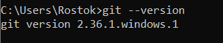

`	`**Мета роботи:** У даній лабораторній роботі нам потрібно ознайомитися із системою контролю git. Для цього нам треба буде інсталювати її собі на ПК та створити тестовий репозиторій, щоб ознайомитися із базовими принципами роботи.

`	`**Виконання роботи:**

1. Спочатку реєструємося на GitHub. Після реєстрації та вказання своєї адреси пошти, а також паролю, ми успішно створюємо наш акаунт.

Рисунок 1.1 – Аватар, ім’я користувача та статус акаунту

Так як, в мене вже був встановлений git мануально ще в 2021 році, а також я був знайомий з системою git та github в мене це не викликало труднощів.

Перевіряємо вірність встановлення git.

Рисунок 1.2 – Перевірка версії git

`	`Git був встановлений коректно.

1. Зробимо глобальні налаштування git на нашому ПК, щоб він коректно розпізнавав наш обліковий запис. Це робиться двома командами.

git config --global user.name “tarakan1van”

git config --global user.email tarakanivan839@gmail.com

1. Далі потрібно згенерувати ключ для SSH доступу до репозиторію. Це робиться наступною командою:

ssh-keygen -t ed25519 -C " tarakanivan839@gmail.com "

`	`Програма запропонує нам назвати ключ та за бажанням обрати директорію, відмінну від стандартної. Також можна задати пароль для даного ключа. Після створення ключа, у папці C:\Users\Rostok\.ssh потрібно знайти публічну версію даного ключа та додати її до GitHub. Це буде виглядати наступним чином.

Рисунок 1.3 – Доданий SSH ключ

1. Створимо новий репозиторій на сайті GitHub. Треба зробити його відкритим, а також назвати згідно нашого імені користувача, щоб він міг відображатися у профілі. Треба не забути додати Readme.md. Репозиторій виглядатиме приблизно наступним чином.

Рисунок 1.4 – Створений репозиторій

1. Скопіюємо SSH ключ із нашого репозиторію.

Рисунок 1.5 – Місцезнаходження ключа

За допомогою VisualStudio Code склонуємо репозиторій.Спочатку в нас запросять ввійти в свій акаунт git

Рисунок 1.6 – Вхід у GitHub для VSCode

Як ми можемо побачити аккаунт автоматично підтянув потрібний нам репозиторій

Рисунок 1.7 – Вибірка репозиторію

Після підтвердження та обрання папки куди буде скопійований репозиторій, ми побачимо що все пройшло як потрібно

Рисунок 1.7 – Скопійований репозиторій

1. ` `Відкриємо файл README.md і відредагуємо опис нашого профілю. Після редагування пишемо такі команди.

git add .

git commit

git push

`	`На другій команді відкриється наш текстовий редактор і можна буде ввести коментар до commit.

1. Розглянемо отриманий результат.

Рисунок 1.8 – Результат роботи над README.md

Висновки

`	`У цій лабораторній роботі ми ознайомилися з системою контролю версій Git та сервісом GitHub, навчилися працювати з Git на практиці, використовуючи основні команди для роботи з репозиторієм. Крім того, ми згенерували ключ SSH та додали його до нашого профілю, щоб аутентифікувати наш ПК. На закінчення ми створили невеличке резюме для нашого профілю.
