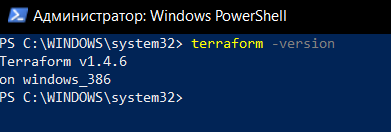

**1. Встановлення Terraform**

Цей абзац не потребує особливого пояснення. Terraform можна встановити за допомогою інсталятора, який надає розробник, або через менеджер пакетів. У цьому випадку ми оберемо встановлення terraform вручну. Щоб переконатися у коректності установки, достатньо виконати будь-яку команду. Наприклад,

terraform -version

Тоді отримаємо такий вивід

**2. Автоматизація створення віртуальної машини**

Тепер створимо віртуальну машину настільки автоматизовано, наскільки це є можливим. Для цього треба виконати декілька дій.

**2.1. Створення нового проекту**

Створимо новий проект, щоб попередні налаштування нам не заважали.

**2.2. Створення service account**

Для того, щоб забезпечити можливість виконання terraform певних завдань у нашому новому проекті та забезпечити GCP інформацію про перевірений сервіс, потрібно створити service account. Для цього можна перейти до пункту Dashboard -> Service Account, натиснути кнопку Create Service Account, вказати назву акаунту, призначити йому ідентифікатор та ролі. Як результат, буде створений новий акаунт, зареєстрований у системі.

**2.3. Створення ключу доступу**

Далі там треба зайти в Actions -> Manage keys і створити там новий ключ в форматі JSON.

Тепер можна перейти до конфігурації terraform.

**2.4. Налаштування Terraform**

Тепер нам потрібно створити робочу директорію для terraform. Створюємо її будь-яким зручним методом.

Далі ми створимо 3 файли: main.tf, variables.tf, outputs.tf. Спочатку попрацюємо з основним файлом main.tf із основною конфігурацією.

Щоб створити віртуальну машину за необхідними умовами, напишемо наступний код

terraform {

`  `required_providers {

`    `google = {

`      `source = "hashicorp/google"

`      `version = "4.51.0"

`    `}

`  `}

}

provider "google" {

`  `credentials = file("mygcpkey.json")

`  `project = "terform"

`  `region = "northamerica-northeast2"

`  `zone = "northamerica-northeast2-a"

}

resource "google_compute_network" "vpc_network" {

`  `name = "vpc-network"

`  `project = "terform"

}

resource "google_compute_subnetwork" "subnet-1" {

`  `name = "subnet-1"

`  `network = google_compute_network.vpc_network.id

`  `ip_cidr_range = "10.2.0.0/16"

`  `region = "northamerica-northeast2"

}

resource "google_compute_instance" "my_server" {

`  `name = "my-server"

`  `machine_type = "f1-micro"

`  `tags = ["khai", "linux", "devops", "ukraine"]

`  `boot_disk {

`    `initialize_params {

`      `image = "debian-cloud/debian-11"

`    `}

`  `}

`  `network_interface {

`    `network = google_compute_network.vpc_network.name

`    `access_config {

`    `}

`  `}

}

resource "google_compute_firewall" "vpc-network-allow" {

`  `name = "letmein"

`  `network = google_compute_network.vpc_network.self_link

`  `allow {

`    `protocol = "tcp"

`    `ports = ["80", "8080", "1000-2000"]

`  `}

`  `target_tags = ["http-server","https-server"]

`  `source_tags = ["vpc-network-allow"]

}

Що тут важливо пояснити:

1. Спочатку ми вказуємо terraform, що будемо працювати із gcp
1. Окрім vpc_network, що ми створювали зазвичай, додався також модуль gcp під назвою google_compute_subnetwork для створення, як можна здогадатися, subnetworks. Ми дали цьому ресурсу локальну назву subnet-1, створили його у тому ж регіоні та vpc мережі, що і наша машина, а також задали діапазон адресів, що може займатися даною підмережею.
1. Далі ми створюємо нашу віртуальну машину з необхідними тегами. Це ми робили в попередній роботі.
1. Наостанок ми конфігуруємо брандмауер для того, щоб він дозволив роботу із tcp протоколом на вказаних портах, а також, що дуже важливо, щоб він дозволив роботу із протоколами http та https.

Файли variables.tf та outputs.tf виглядають наступним чином.

variables.tf

variable "project" {

`    `default = "terform"

}

variable "credentials_file" {

`    `default = "mygcpkey.json"

}

variable "region" {

`    `default = "northamerica-northeast2"

}

variable "zone" {

`    `default = "northamerica-northeast2-a"

}

variable "my_server" {

`    `default = "my-server"

}

variable "subnet-1" {

`  `default = "subnet-1"

}

outputs.tf

output "ip_intra" {

`  `value = google_compute_instance.my_server.network_interface.0.network_ip

}

output "ip_extra" {

value = google_compute_instance.my_server.network_interface.0.access_config.0.nat_ip

}

Тепер маємо змогу зайти до директорії через термінал та прописати команду

terraform init

Отримуємо наступне повідо млення, що свідчить про коректну ініціалізацію директорії.

Далі пишемо

terraform apply

І отримуємо список того, що планує зробити terraform.

Якщо нас все влаштовує, пишемо "yes" і чекаємо на створення віртуальної машини і її структури.

Все пройшло коректно і від terraform ми отримали таке повідомлення.

Помітимо, що у машини є дві ip-адреси. Одна з них -- внутрішня адреса у VPC мережі Google, а інша -- адреса NAT, тобто можна сказати, що вона глобальна і через неї можна під'єднатися до нашої ВМ ззовні.

Подивимося на те, чи вірно все було створено.

` ` 

Ми бачимо, що все було виконано правильно: машина була належним чином створена і отримала всі адреси, які були виведені у консоль. Брандмауер дозволив з'єднання http та https, а також була створена subnetwork з параметрами, які ми встановили. Отже, все заплановане було виконано належним чином. Ми можемо знищити нашу віртуальну машину за допомогою наступної команди.

terraform destroy

Підтверджуємо видалення командою yes і чекаємо.

В нас не залишилося ні віртуальної машини, ні мережі, тобто terraform виконав видалення вірно і не залишив нічого, чого ми й хотіли.
